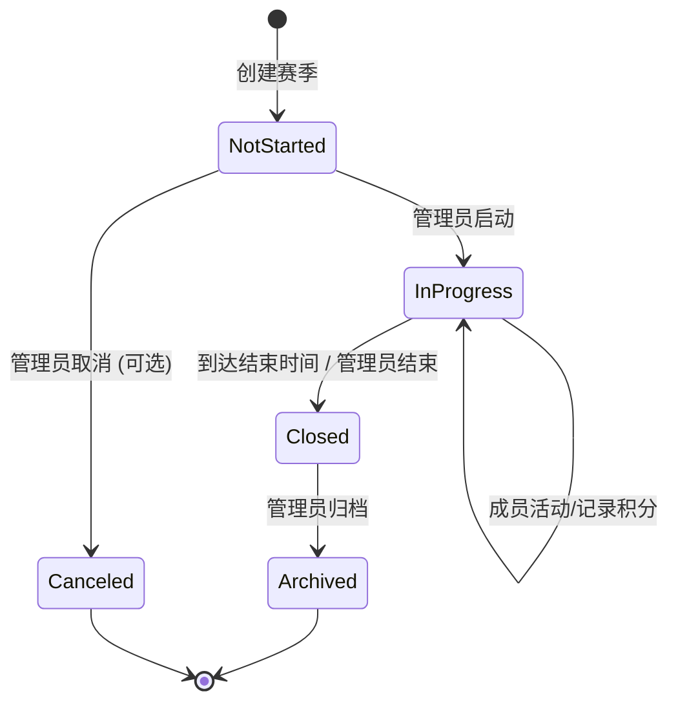
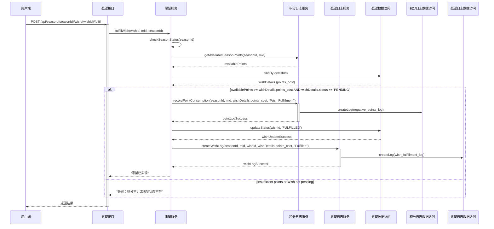

# 计划：赛季模块实施

**ID:** 1
**状态:** [x] 已完成
**模块:** 赛季系统
**负责人:** (待分配)
**创建日期:** $(date +%Y-%m-%d)
**最后更新:** $(date +%Y-%m-%d)

## 1. 概述

本计划旨在为现有应用引入赛季模块。该模块的设计将严格参考现有常规模式的模块和接口，以确保一致性和复用性。赛季模块允许管理员创建具有特定起止时间、专属代币和独立积分规则的赛季。成员在赛季内完成任务获得赛季积分，赛季结束后积分可能会作废或按比例结转。赛季模式下的愿望（Wish）创建和实现也将与赛季积分绑定，并有独立的愿望实现日志。

## 2. 需求回顾

*   支持创建和管理赛季（`season_config`）。
*   赛季与成员（`m_id`）关联。
*   支持为每个赛季定义专属的积分规则 (`season_rules`)，其结构和API应参考 `MemberRules.java` 和 `MemberController.java` 中的相关逻辑。
*   记录成员在赛季内的积分获取日志 (`season_point_logs`)，其结构和API应参考 `MemberPointLogs.java` 和 `MemberController.java` 中的相关逻辑。此表不直接关联愿望ID。
*   成员表（`member`）需增加字段 `mode` (**VARCHAR**) 以支持模式切换（例如 "NORMAL", "SEASON"）和 `current_season_id` (BIGINT) 记录当前赛季ID。
*   API接口通过路径区分常规模式与赛季模式: 所有赛季相关接口均以 `/api/season/{seasonId}/...` 为前缀。
*   **赛季愿望系统**:
    *   `season_wishes` 表: 存储愿望定义，精确参考 `Wish.java` 并增加 `season_id`。API参考 `WishController.java`。
    *   `season_wish_logs` 表: 记录愿望的实现/兑换等操作日志，参考 `WishLog.java` 并增加 `season_id`。API参考 `WishLogController.java`。
    *   实现愿望时，会在 `season_point_logs` 中记录积分消耗 (type 为"愿望消耗")，在 `season_wishes` 中更新状态，并在 `season_wish_logs` 中创建一条记录。

*   权限控制。

## 3. 详细实施计划

### 阶段一：数据库与模型层 (Models & Database)

*   **任务 1.1:** [ ] 设计并创建数据库表结构。
    *   `season_config` (赛季配置表)
        *   `id` (BIGINT, PK, AI)
        *   `m_id` (INT)
        *   `name` (VARCHAR)
        *   `start_time` (DATETIME)
        *   `end_time` (DATETIME)
        *   `token_name` (VARCHAR)
        *   `token_icon` (VARCHAR, nullable)
        *   `conversion_rate` (INT)
        *   `initial_points` (INT)
        *   `status` (TINYINT) - (0:未开始, 1:进行中, 2:已结束, 3:已归档)
        *   `create_time` (DATETIME)
        *   `update_time` (DATETIME)
    *   `season_rules` (赛季规则表) - **参考 `MemberRules.java`**
        *   `id` (BIGINT, PK, AI)
        *   `season_id` (BIGINT, FK -> `season_config.id`)
        *   `m_id` (INT)
        *   `name` (VARCHAR)
        *   `icon` (VARCHAR, nullable)
        *   `icon_type` (VARCHAR, nullable)
        *   `type` (VARCHAR, nullable) - 规则分类
        *   `status` (TINYINT)
        *   `sort` (INT, default 0) - 分类内排序
        *   `day_limit` (INT, nullable) - 单日限制
        *   `point` (INT) - 规则积分
        *   `quick_score` (INT, nullable)
        *   `enable_pomodoro` (BOOLEAN, default false)
        *   `pomodoro_time` (INT, nullable)
        *   `content` (TEXT, nullable) - 描述/内容
        *   `type_sort` (INT, nullable) - 分类排序
        *   `create_time` (DATETIME)
        *   `update_time` (DATETIME)
    *   `season_point_logs` (赛季积分日志表) - **参考 `MemberPointLogs.java`**
        *   `id` (BIGINT, PK, AI)
        *   `season_id` (BIGINT, FK -> `season_config.id`)
        *   `day` (DATETIME)
        *   `mid` (INT)
        *   `uid` (INT, nullable)
        *   `rule_id` (BIGINT, FK -> `season_rules.id`, nullable)
        *   `num` (INT)
        *   `type` (TINYINT) - (0:规则积分, 1:调整, 2:赛季转换, 3:愿望消耗)
        *   `remark` (VARCHAR, nullable)
        *   `pomodoro_time` (INT, nullable)
        *   `created_at` (DATETIME)
        *   `updated_at` (DATETIME)
    *   `season_wishes` (赛季愿望表) - **精确参考 `Wish.java` 结构，并增加 `season_id`**
        *   `id` (BIGINT, PK, AI)
        *   `season_id` (BIGINT, FK -> `season_config.id`) - **新增字段**
        *   `mid` (INT)
        *   `img` (VARCHAR, nullable)
        *   `title` (VARCHAR)
        *   `content` (TEXT, nullable)
        *   `need_point` (INT)
        *   `unit` (INT, nullable)
        *   `unit_type` (VARCHAR, nullable)
        *   `type` (TINYINT)
        *   `status` (TINYINT)
        *   `created_at` (DATETIME)
        *   `updated_at` (DATETIME)
    *   `season_wish_logs` (赛季愿望实现日志表) - **参考 `WishLog.java`，并增加 `season_id`**
        *   `id` (BIGINT, PK, AI)
        *   `season_id` (BIGINT, FK -> `season_config.id`) - **新增字段**
        *   `mid` (INT)
        *   `uid` (INT, nullable)
        *   `wid` (BIGINT, FK -> `season_wishes.id`)
        *   `point` (INT)
        *   `info` (VARCHAR, nullable)
        *   `status` (TINYINT)
        *   `amount` (INT, nullable)
        *   `unit_type` (VARCHAR, nullable)
        *   `end_time` (DATETIME, nullable)
        *   `unit` (INT, nullable)
        *   `created_at` (DATETIME)
        *   `updated_at` (DATETIME)
*   **任务 1.2:** [ ] 更新 `member` 表结构。
    *   添加 `mode` (**VARCHAR**, default "NORMAL") - 模式 (e.g., "NORMAL", "SEASON")
    *   添加 `current_season_id` (BIGINT, nullable, FK -> `season_config.id`)
*   **任务 1.3:** [ ] 创建 Java Model 实体类。
    *   `SeasonConfig.java`
    *   `SeasonRule.java`
    *   `SeasonPointLog.java`
    *   `SeasonWish.java` (精确镜像 `Wish.java` + `seasonId`)
    *   `SeasonWishLog.java` (镜像 `WishLog.java` + `seasonId`)
    *   `Member.java` 中 `mode` 字段类型更新为 `String`。

### 阶段二：数据访问层 (DAO / Mapper)

*   **任务 2.1 & 2.2:** [ ] 创建 MyBatis Mapper XML 文件和 Java Mapper 接口。
    *   `SeasonConfigMapper`
    *   `SeasonRuleMapper` (方法类似 `MemberRulesMapper`)
    *   `SeasonPointLogMapper` (方法类似 `MemberPointLogsMapper`)
    *   `SeasonWishMapper` (方法类似 `WishMapper`)
    *   `SeasonWishLogMapper` (方法类似 `WishLogMapper`)

### 阶段三：服务层 (Service)

*   **任务 3.1 & 3.2:** [ ] 创建 Service 接口和实现类。
    *   `SeasonConfigService` / `SeasonConfigServiceImpl`
    *   `SeasonRuleService` / `SeasonRuleServiceImpl`
    *   `SeasonPointLogService` / `SeasonPointLogServiceImpl`
        *   积分扣除逻辑，当 type 为 "愿望消耗" 时，正常记录负积分。
    *   `SeasonWishService` / `SeasonWishServiceImpl`
        *   `fulfillWish` 方法:
            1.  检查积分 (调用 `SeasonPointLogService` 获取当前赛季可用积分)。
            2.  更新 `SeasonWish` 状态。
            3.  调用 `SeasonPointLogService` 记录类型为3（愿望消耗）的积分。
            4.  调用 `SeasonWishLogService` 创建一条 `SeasonWishLog` 记录。
            5.  确保事务性。
    *   `SeasonWishLogService` / `SeasonWishLogServiceImpl`
        *   负责创建和查询 `SeasonWishLog` 记录。

### 阶段四：控制层 (Controller)

*   **任务 4.1:** [x] 创建 Controller 类。
    *   `SeasonConfigController.java`
    *   `SeasonRuleController.java`
    *   `SeasonPointController.java`
    *   `SeasonWishController.java`
    *   `SeasonWishLogController.java` (已合并到 SeasonWishController)
*   **任务 4.2:** [x] 定义 RESTful API 接口。
    *   `SeasonConfigController`:
        *   `POST /api/season/config`
        *   `PUT /api/season/config/{configId}`
        *   `GET /api/season/config/member/{mid}`
        *   `GET /api/season/config/{configId}`
        *   `POST /api/season/config/{configId}/start`
        *   `POST /api/season/config/{configId}/end`
    *   `SeasonRuleController`: **方法签名、DTOs和逻辑参考 `MemberController.java` 中规则相关部分。**
        *   `POST /api/season/{seasonId}/member/{mid}/rule`
        *   `GET /api/season/{seasonId}/member/{mid}/rulesWithStatus?day=YYYY-MM-DD`
        *   `PUT /api/season/{seasonId}/rule/{ruleId}`
        *   `DELETE /api/season/{seasonId}/rule/{ruleId}`
    *   `SeasonPointController`: **方法签名、DTOs和逻辑参考 `MemberController.java` 中积分日志相关部分。**
        *   `POST /api/season/{seasonId}/member/{mid}/log`
        *   `GET /api/season/{seasonId}/member/{mid}/logs?date=YYYY-MM-DD...`
        *   `GET /api/season/{seasonId}/member/{mid}/summary?day=YYYY-MM-DD`
    *   `SeasonWishController`: **方法签名、DTOs和逻辑参考 `WishController.java`。**
        *   `POST /api/season/{seasonId}/member/{mid}/wish`
        *   `GET /api/season/{seasonId}/member/{mid}/wishes`
        *   `PUT /api/season/{seasonId}/wish/{wishId}`
        *   `DELETE /api/season/{seasonId}/wish/{wishId}`
        *   `POST /api/season/{seasonId}/wish/{wishId}/fulfill` (此接口触发愿望实现流程)
        *   `GET /api/season/{seasonId}/member/{mid}/wishes/summary`
    *   `SeasonWishLogController` API (或作为 `SeasonWishController` 的一部分): **参考 `WishLogController.java`**
        *   `GET /api/season/{seasonId}/member/{mid}/wish/{wishId}/logs` (获取特定赛季愿望的实现日志)
        *   `GET /api/season/{seasonId}/member/{mid}/wishlogs` (获取成员在当前赛季的所有愿望实现日志)
*   **任务 4.3:** [x] 实现权限控制。

### 阶段五：核心业务逻辑与流程

*   **任务 5.1:** [x] 实现赛季生命周期管理。
    *   赛季创建、启动、结束、归档等状态转换管理。
*   **任务 5.2:** [x] 实现赛季任务与积分。
    *   管理员发布赛季任务（即创建赛季规则）。
    *   成员完成任务和积分记录逻辑。
*   **任务 5.3:** [x] 实现成员模式切换。
    *   允许成员在常规模式和赛季模式之间切换。
    *   切换到赛季模式时关联到指定赛季。
*   **任务 5.4:** [x] 实现赛季愿望流程。
    *   成员在激活的赛季内创建愿望 (存入 `season_wishes`)。
    *   实现愿望时，系统检查对应赛季的积分余额。
    *   足够则：
        1.  在 `season_point_logs` 记录积分扣除 (type=3)。
        2.  更新 `season_wishes` 中对应愿望的状态为"已实现"。
        3.  在 `season_wish_logs` 中创建一条实现记录，关联到 `season_wishes.id`。

### 阶段六：测试

*   **任务 6.1:** [ ] 单元测试。
    *   对 Service 层和 DAO 层的关键逻辑编写单元测试。
    *   测试积分计算、状态转换、数据读写、规则状态获取等。
*   **任务 6.2:** [ ] 集成测试。
    *   测试 Controller 层接口，验证请求处理、参数校验、服务调用和响应。
*   **任务 6.3:** [ ] 端到端手动测试。
    *   测试赛季配置管理流程。
    *   测试赛季规则管理流程。
    *   测试赛季积分记录和查询流程。
    *   测试赛季愿望管理和实现流程。
    *   测试成员模式切换流程。

## 4. 潜在风险及应对措施

*   **风险1:** 数据模型设计不完善导致后期难以扩展。
    *   **应对:** 在设计阶段充分讨论，参考现有成熟系统，预留扩展字段或表。进行多轮评审。
*   **风险2:** 赛季切换和积分结转逻辑复杂，容易出错。
    *   **应对:** 详细设计状态转换图和处理流程，编写充分的单元测试和集成测试覆盖各种边界情况。确保事务一致性。
*   **风险3:** 新增大量数据表和查询可能影响性能，特别是聚合查询。
    *   **应对:** 对关键查询字段建立索引。进行性能测试，对慢查询进行优化。考虑适当的缓存策略。
*   **风险4:** 权限控制逻辑不严谨，导致越权操作。
    *   **应对:** 仔细设计和实现权限校验逻辑，覆盖所有敏感操作接口。进行安全测试。
*   **风险5:** 与现有常规积分系统的数据隔离和交互问题。
    *   **应对:** 明确两种模式的数据归属和业务边界。确保模式切换时数据隔离。
*   **风险6:** 赛季规则和周状态数据整合可能引入bug。
    *   **应对:** 详细设计数据获取和组装流程。编写针对性的单元测试和服务层测试。
*   **风险7:** 愿望实现时，三表数据一致性问题。
    *   **应对:** 整个愿望实现操作必须放在一个事务中，确保三表操作的原子性。

## 5. 测试策略

*   **单元测试:** 使用 JUnit/Mockito 等框架，覆盖 Service 层核心业务逻辑和 DAO 层数据操作。
*   **集成测试:** 使用 Spring Boot Test 或类似工具，测试 Controller API 接口，验证数据流和组件协作。
*   **手动测试:**
    *   **管理员流程:** 创建赛季 -> 添加规则 -> 启动赛季 -> 审核任务 -> 结束赛季 -> 查看结算。
    *   **成员流程:** 查看赛季 -> 切换模式 -> 完成任务 -> 查看赛季积分 -> 创建愿望 -> 实现愿望。
    *   **测试场景覆盖:**
        *   赛季起止时间的精确性
        *   积分结转比例的准确性
        *   并发操作
        *   愿望实现的三表一致性
        *   权限控制的准确性

## 6. Mermaid 图表

### 赛季状态流转图

### 赛季愿望实现流程 (简化时序图)

## 7. 后续步骤

*   团队成员认领各项任务。
*   根据实际开发进度更新计划状态。
*   定期回顾计划，根据需要进行调整。 