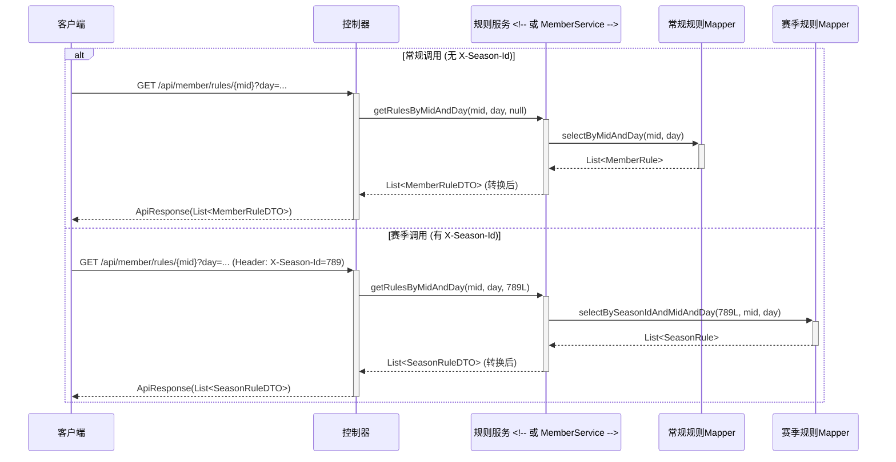

# 计划：整合赛季功能至现有 Controller/Service (通过请求头区分) - 讨论稿 v3

**ID:** 4 (暂定)
**状态:** [ ] 已规划
**概要:** 修改部分现有的 Controller 及其对应的 Service，通过可选的 `X-Season-Id` 请求头参数动态处理常规数据或赛季数据。明确废弃先前为赛季创建的独立 Controller (如 `SeasonMemberController`, `SeasonWishController` 等)，并将其功能合并到现有对应组件中。`SeasonConfigController` 及用户明确指定的其他几个 Controller 保持不变。

## 1. 背景与目标

为了给应用全面引入赛季模式，同时最大化代码复用并简化接口结构，本方案提议修改现有的、非排除列表中的 Controller 和 Service。通过在这些组件的方法中引入一个可选的 `seasonId` 参数 (来源于 `X-Season-Id` 请求头)，实现对常规数据和赛季数据的动态处理。

**目标:**
*   在不新增 Controller/Service (针对规则、积分、愿望、成就等核心业务) 的前提下，为系统增加赛季功能。
*   废弃 `SeasonMemberController`, `SeasonRuleAchievementController`, `SeasonRuleAchievementLogController`, `SeasonWishController`, `SeasonWishLogController`，将其功能逻辑迁移到现有的对应 Controller 和 Service 中。
*   保持 Model, DAO, Mapper 层的独立性，为赛季数据创建新的实体和映射文件 (如 `SeasonRule.java`, `SeasonPointLog.java`, `SeasonWish.java`, `SeasonRuleAchievement.java` 等)。
*   通过请求头 `X-Season-Id` (可选) 区分常规调用和赛季调用。
*   API 路径将基于现有 Controller 的原始路径，不再使用特定于赛季的前缀。

## 2. 数据库与数据模型层

### 2.1. 数据库层面
1.  **创建新表 (无物理外键，表名下划线，字段驼峰):**
    *   `season_config` (赛季配置核心表) - *由 `SeasonConfigController` 管理，不直接参与本方案的 `X-Season-Id` 机制*
    *   `season_rules`
    *   `season_point_logs`
    *   `season_wishes`
    *   `season_wish_logs`
    *   `season_rule_achievements`
    *   `season_rule_achievement_logs`
2.  **修改现有表:**
    *   `member` 表:
        *   增加 `current_season_id` (BIGINT, nullable) 字段。
        *   **保留 `mode` (VARCHAR) 字段** 并确保其能被读写。

### 2.2. Java Model 实体类
*   `SeasonConfig.java`
*   `SeasonRule.java`
*   `SeasonPointLog.java`
*   `SeasonWish.java`
*   `SeasonWishLog.java`
*   `SeasonRuleAchievement.java`
*   `SeasonRuleAchievementLog.java`
*   `Member.java` (更新字段，包括 `mode` 和 `currentSeasonId`)

### 2.3. Java Mapper 接口和 XML 文件
*   为所有赛季相关的 Model 创建对应的 Mapper 接口和 XML。
*   `MemberMapper.xml` (确保支持 `mode` 和 `currentSeasonId` 的读写)。

## 3. 受影响的模块与 Controller/Service 修改策略

### 3.1. 通用处理要求（适用于所有赛季化改造模块）

在对任何模块进行赛季化改造时，必须遵循以下通用规则：

- 只在有 seasonId 时走赛季分支，其他情况保持原有逻辑。
- 不得删除或更改原有注释和业务逻辑。
- 所有统计方法、SQL、注释、参数必须规范、同步、详实。

> 以上要求适用于所有涉及赛季化改造的 Controller、Service、Mapper 及 SQL 层，确保赛季模式与原有模式逻辑解耦、注释完整、实现规范，便于后续维护和扩展。

### 3.2. 明确不进行赛季化修改的 Controller (根据用户指定)
*   `WxuserController.java`
*   `WxEventController.java`
*   `TImageController.java`
*   `AccountController.java`
*   `BannerImageController.java`
*   `CalculationController.java`
*   `GameConfigController.java`
*   `GameRewardLogController.java`
*   `SeasonConfigController.java` (*保持现状*)
*   `AchievementCategoryController.java` (*新增排除*)
*   `GameRewardController.java` (*新增排除*)
*   `IndexController.java` (*新增排除*)
    *(这些 Controller 对应的 Service 也不进行赛季化修改)*

### 3.3. 将被废弃的 Controller (其功能并入现有常规 Controller)
*   `SeasonMemberController.java` (其规则和积分日志功能将整合入 `MemberController` 调用链)
*   `SeasonRuleAchievementController.java` (其功能将整合入 `RuleAchievementController` 调用链)
*   `SeasonRuleAchievementLogController.java` (其功能将整合入 `RuleAchievementLogController` 调用链)
*   `SeasonWishController.java` (其功能将整合入 `WishController` 调用链)
*   `SeasonWishLogController.java` (其功能将整合入 `WishLogController` 调用链)

### 3.4. 需要修改的 Controller (及对应 Service)

以下 Controller 及其对应的 Service 层需要进行修改，以支持通过 `X-Season-Id` 请求头进行赛季功能切换。

1.  **`MemberController.java`**
    *   **Controller 方法:**
        *   **成员信息管理相关方法** (如获取/创建/更新成员基本资料): **不增加** `X-Season-Id` 请求头参数。
        *   **规则 (Rules) 相关方法** (如获取规则列表 `/member/rules/{mid}` (原 `/api/season/member/rules/{mid}`), 创建/更新/删除规则等): 增加 `@RequestHeader(value = "X-Season-Id", required = false) Long seasonId`。
        *   **积分日志 (PointLogs) 相关方法** (如获取积分日志 `/member/pointlogs/{mid}` (原 `/api/season/member/pointlogs/{mid}`), 记录积分等): 增加 `seasonId` 请求头。
    *   **Service 方法 (例如 `MemberService`, 或拆分的 `MemberRulesService`, `MemberPointLogsService`):**
        *   对应方法增加 `Long seasonId` 参数。
        *   **业务逻辑迁移**: 原 `SeasonRuleService` 和 `SeasonPointLogService` (或类似为赛季创建的 Service) 中处理赛季规则和赛季积分的业务逻辑，需要完整地迁移或合并到这些现有的常规 Service 方法中。当 `seasonId` 非空时，执行这些源自赛季 Service 的逻辑，并调用赛季相关的 Mapper (`SeasonRuleMapper`, `SeasonPointLogMapper`)。当 `seasonId` 为空时，执行常规逻辑并调用常规 Mapper (`MemberRulesMapper`, `MemberPointLogsMapper`)。

2.  **`RuleAchievementController.java`** (对应 `RuleAchievementService`)
    *   **Controller 方法:** (如 `getById`, `create`, `update`, `listByRule` 等)
        *   增加 `@RequestHeader(value = "X-Season-Id", required = false) Long seasonId`。
        *   传递 `seasonId` 给 Service。
    *   **Service 方法 (`RuleAchievementService`):**
        *   增加 `Long seasonId` 参数。
        *   **业务逻辑迁移**: 原 `SeasonRuleAchievementService` 的逻辑并入。
        *   内部逻辑: `if (seasonId != null) { // 调用 SeasonRuleAchievementMapper } else { // 调用 RuleAchievementMapper }`

3.  **`RuleAchievementLogController.java`** (对应 `RuleAchievementLogService`)
    *   **Controller 方法:** (如 `getLogById`, `insertLog`, `checkMemberAchievements` 等)
        *   增加 `@RequestHeader(value = "X-Season-Id", required = false) Long seasonId`。
        *   传递 `seasonId` 给 Service。
    *   **Service 方法 (`RuleAchievementLogService`):**
        *   增加 `Long seasonId` 参数。
        *   **业务逻辑迁移**: 原 `SeasonRuleAchievementLogService` 的逻辑并入。
        *   内部逻辑: `if (seasonId != null) { // 调用 SeasonRuleAchievementLogMapper } else { // 调用 RuleAchievementLogMapper }`
        *   `checkMemberAchievements` 方法: 如果 `seasonId` 为 null，应明确行为（例如，不执行或返回错误，因为此检查通常与赛季相关）。

4.  **`WishController.java`** (对应 `WishService`)
    *   **Controller 方法:** 增加 `seasonId` 请求头。
    *   **Service 方法 (`WishService`):** 增加 `Long seasonId` 参数。
        *   **业务逻辑迁移**: 原 `SeasonWishService` 的逻辑并入。
        *   内部逻辑: `if (seasonId != null) { // 调用 SeasonWishMapper } else { // 调用 WishMapper }`

5.  **`WishLogController.java`** (对应 `WishLogService`)
    *   **Controller 方法:** 增加 `seasonId` 请求头。
    *   **Service 方法 (`WishLogService`):** 增加 `Long seasonId` 参数。
        *   **业务逻辑迁移**: 原 `SeasonWishLogService` 的逻辑并入。
        *   内部逻辑: `if (seasonId != null) { // 调用 SeasonWishLogMapper } else { // 调用 WishLogMapper }`
        *   **核心逻辑 `fulfillWish`**: 当 `seasonId` 存在时，积分检查、状态更新、日志记录均针对赛季表；否则针对常规表。

6.  **`StatisticsController.java`** (对应 `StatisticsService` - 假设存在)
    *   评估：如果统计数据需要按赛季区分（例如 "本赛季积分排行榜" vs "总排行榜"），则需要修改。
    *   若修改：Controller 方法增加 `seasonId` 请求头，Service 方法增加 `seasonId` 参数，统计逻辑根据 `seasonId` 过滤数据。

    **赛季统计相关处理要求：**
    - 只在有 seasonId 时走赛季统计分支，其他情况保持原有逻辑。
    - 不得删除或更改原有注释和业务逻辑。
    - 所有统计方法、SQL、注释、参数必须规范、同步、详实。

### 3.5. Service 层通用修改策略
*   **参数:** 相应方法统一增加 `Long seasonId` 参数。
*   **依赖注入:** Service 实现类中需要同时注入常规 Mapper 和赛季 Mapper。
*   **逻辑分支:** `if (seasonId != null)` 作为主要判断依据。
*   **返回类型与方法签名:** **泛型服务方法策略 (新标准)**
    *   **Service 接口层:** 对于需要根据 `seasonId` 返回不同类型实体（常规实体或其对应的赛季实体）的服务方法，其签名将进行泛型化处理。
        *   方法将包含一个泛型参数 `<T>`。
        *   方法将增加一个 `Class<T> expectedType` 参数，由调用方（Controller）传入，用于指定期望返回的具体实体类型。
        *   示例：原 `Wish getWishById(Integer id, Long seasonId);` 修改为 `<T> T getWishById(Integer id, Long seasonId, Class<T> expectedType);`
        *   示例：原 `List<Wish> getAllWishes(Long seasonId);` 修改为 `<T> List<T> getAllWishes(Long seasonId, Class<T> expectedType);`
        *   注：`void` 返回类型的方法不受此泛型化影响。
    *   **Service 实现层:**
        *   根据 `seasonId` 的有无以及调用方传入的 `expectedType`，选择调用常规 Mapper 或赛季 Mapper。
        *   从 Mapper 获取数据后，使用 `expectedType.isAssignableFrom()` 检查类型兼容性，并使用 `expectedType.cast()` 进行类型转换后返回。
        *   此策略下，服务层直接返回具体的实体对象（如 `Wish` 或 `SeasonWish`），不再需要中间的 DTO 转换层或如 `convertToWish` 之类的辅助转换方法，除非特定业务场景下仍需对数据进行进一步塑形。
        *   **重点关注**: 在使用 `BeanUtils.copyProperties` 或直接操作实体进行数据准备（尤其是在创建/更新操作中，数据从 `*Request` DTO 映射到实体时）以及与 Mapper 交互时，务必仔细处理不同实体间（如 `Wish` vs `SeasonWish`）以及 DTO 与实体间可能存在的字段类型差异（例如，`id` 字段在 `WishRequest` 中为 `Integer`，在 `Wish` 中为 `Integer`，但在 `SeasonWish` 中为 `Long`；`mid` 字段在 `WishRequest` 中为 `String`，在 `Wish` 中为 `String`，但在 `SeasonWish` 中为 `Integer`）。确保类型转换正确无误。
    *   **Controller 层:**
        *   在调用服务层方法时，Controller 将根据当前请求是否包含 `X-Season-Id` 来决定传递给 `expectedType` 参数的具体类（例如 `Wish.class` 或 `SeasonWish.class`）。
        *   Controller 将因此直接接收到强类型的实体对象或列表，并将其包装在 `ApiResponse` 中。
    *   此泛型策略取代了先前推荐的"统一DTO策略"或返回 `Object` 类型后手动转换的策略，旨在提高类型安全性和代码清晰度。
*   **业务逻辑的严格迁移**: 确保原赛季 Service 中的特定业务规则（例如积分计算方式、规则适用条件等）在合并到常规 Service 后，在 `seasonId != null` 的分支中得到正确执行。

### 3.6. Mapper 层通用修改策略 (新标准)
*   **Mapper优先原则**: 对于所有涉及赛季ID (`seasonId`) 的操作（查询、更新、删除），应优先在 Mapper 层（Java接口和XML）实现通过 `seasonId` 直接在数据库层面进行数据筛选的方法。
*   **避免Java层过滤**: 尽量避免在 Service 层 Java 代码中从数据库获取一个可能更大的结果集后，再通过 `if (entity.getSeasonId().equals(seasonId))` 这样的逻辑进行过滤。
*   **新增/优化Mapper方法**: 如果现有的 Mapper 方法不直接支持 `seasonId` 的过滤，则应在 `.java` Mapper 接口和对应的 `.xml` 文件中添加新的方法和SQL语句。例如，对于按主键ID操作的场景，应确保存在如 `getByIdAndSeasonId`, `deleteByIdAndSeasonId` 等方法。对于 `update` 操作，其SQL语句的 `WHERE` 子句也应包含对 `seasonId` 的校验，以确保更新的准确性和安全性。
*   **此策略旨在将赛季数据隔离和校验尽可能地下沉到数据访问层，简化 Service 层逻辑，提高查询效率和数据操作的准确性。**

## 4. API 路径与请求头

*   **API 路径:** 沿用现有 Controller 的路径。例如，获取规则的接口依然是 `MemberController` 下的路径。
*   **请求头:** `X-Season-Id` (Long, optional)。
    *   如果客户端想操作特定赛季的数据，则传递此请求头及对应的赛季 ID。
    *   如果客户端想操作常规数据，则不传递此请求头。

## 5. `member.mode` 字段的用途

*   **保留并由应用管理其读写。**
*   **可能用途:**
    1.  **用户界面（UI）默认模式指示:** 前端可以根据此字段决定默认展示常规视图还是上一个赛季的视图。
    2.  **后端逻辑辅助:** 在某些无法方便传递 `X-Season-Id` 的场景下（例如异步任务、定时调度），可以用此字段作为判断依据之一。
    3.  **记录用户偏好:** 即使用户通过请求头临时切换到某个赛季，此字段可以记录其主要的或最后选择的模式。
    4.  当用户首次进入或未指定 `X-Season-Id` 时，后端可参考此 `mode` 和 `member.current_season_id` 来决定默认加载哪个赛季的数据（如果有活跃赛季）。

## 6. 关键问题与决策点

*   **Service 返回类型策略 (泛型服务方法)。**
*   **Mapper 层数据处理策略 (Mapper优先，数据库层面过滤 `seasonId`)。**
*   **`member.mode` 和 `member.current_season_id` 的交互逻辑:** 如何协同工作以决定用户默认看到的赛季视图（当 `X-Season-Id` 未提供时）。
*   **确保业务逻辑迁移的准确性**: 这是最大的挑战之一，需要仔细对比原有赛季 Service 的实现。

## 7. 风险评估

*   **大规模重构风险:** 修改大量现有 Controller 和 Service 是一项大工程，引入 bug 的风险较高。
*   **逻辑复杂性显著增加:** Service 层和 Controller 层需要处理双重逻辑。
*   **测试覆盖难度大:** 需要为每个受影响的接口测试带 `X-Season-Id` 和不带 `X-Season-Id` 的两种情况。
*   **性能:** 额外的逻辑判断和可能的 DTO 转换会引入微小的性能开销。

## 8. Mermaid 图 (示例：`MemberController` 获取规则列表)

## 9. 后续步骤

*   **详细梳理并列出 `MemberController` 中哪些方法处理规则和积分日志，这些方法需要添加 `X-Season-Id`。**
*   **针对每个受影响的 Service，详细规划如何将原赛季 Service 的逻辑合并进来，并确保在 `seasonId` 存在时正确调用。**
*   设计必要的 DTOs。
*   明确 `member.mode` 字段的更新时机和读取逻辑。
*   制定详细的迁移、代码合并和测试计划。